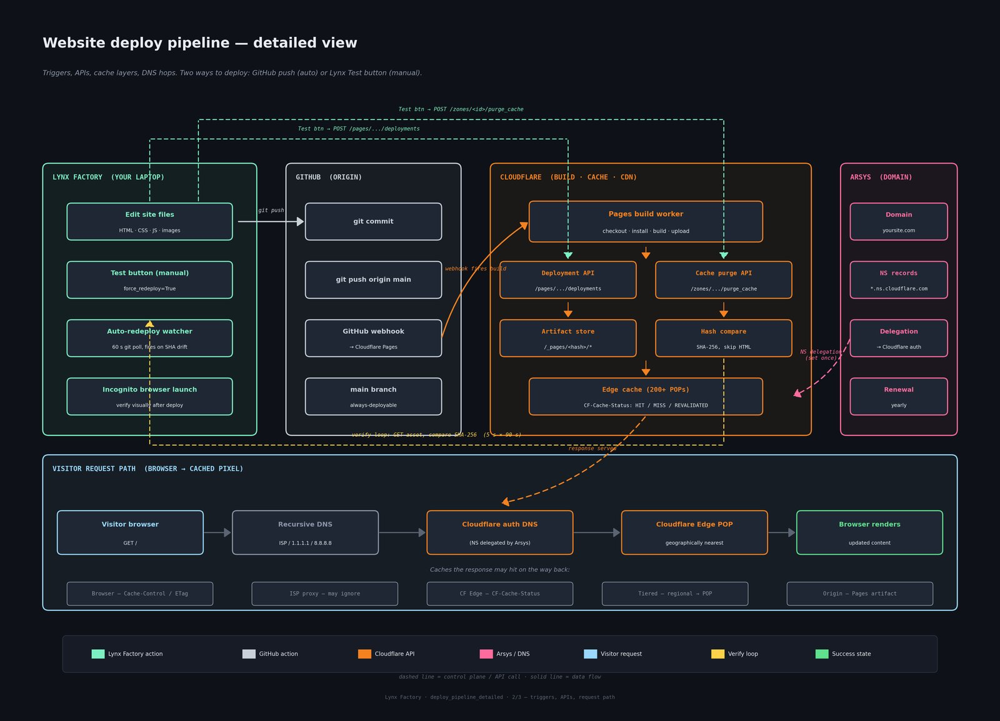
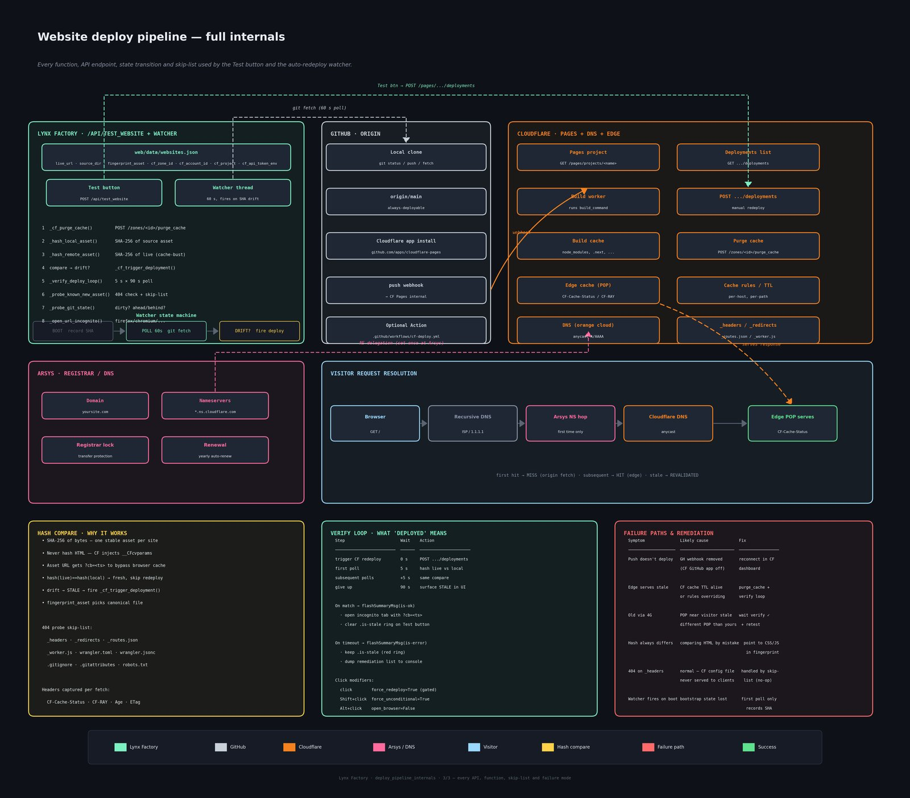

# Galería O+O — galeriaomaso.com

Bilingual (EN/ES) art-gallery website for **Galería Oriente y Occidente**.

- **Live site:** https://www.galeriaomaso.com
- **Hosting:** Cloudflare Workers (deployed via `wrangler`)
- **DNS:** Arsys (registrar) → Cloudflare nameservers
- **Repo:** https://github.com/borjatarraso/galeriaomaso
- **Stack:** static HTML / CSS / JS — no build step, no CMS

> The site was split out of the older `enriquetahueso` repository on
> 2026-05-17. Cross-links between the two sites use absolute URLs.

> 🤝 **Are you an external contributor?**
> Everything between here and the Contributing section describes how the
> **maintainer** (Borja Tarraso) operates the site day-to-day — direct
> pushes to `main`, local helper tooling (Lynx Factory, multiplexers,
> auto-redeploy watchers), Cloudflare credentials, etc. **You do not need
> any of that.** Jump straight to [Contributing](#contributing) for the
> fork → branch → Pull Request workflow that's open to anyone.

---

## How a content change reaches visitors

```
edit  →  commit  →  push  →  Cloudflare build  →  serve from edge
```

The same five-stage flow that every modern static site uses. Each stage
runs on a different machine and can fail independently — which is why we
verify end-to-end on every push.

### Overview diagram


> Click for full resolution: [`docs/deploy_pipeline_overview.png`](docs/deploy_pipeline_overview.png)

### Detailed diagram (stages + APIs + cache layers + DNS)



> Full-screen: [`docs/deploy_pipeline_detailed.png`](docs/deploy_pipeline_detailed.png)

### Internals (every API call, fallback, verify loop)



> Full-screen: [`docs/deploy_pipeline_internals.png`](docs/deploy_pipeline_internals.png)

---

## Day-to-day maintainer workflow

> Only the maintainer (Borja Tarraso) has push access to `main`. If you're
> an external contributor, the workflow you want is in
> [Contributing](#contributing) — fork, branch, Pull Request.

```bash
# 1. edit any html / css / js / image in this repo
$EDITOR index.html

# 2. commit + push to main
git add -A && git commit -m "Tweak hero copy"
git push origin main

# 3. wait ~30–60 s, then verify the live site has the new version
curl -sI https://www.galeriaomaso.com/style.css | grep -i etag
```

If the live site does **not** pick up the change within ~2 minutes, see
the troubleshooting section below — Cloudflare's GitHub auto-deploy
integration can silently disconnect, which is exactly why we built the
verification tooling described next.

---

## Why we ship our own verifier

Cloudflare's "push and forget" GitHub integration looks reliable but has
two failure modes that are silent from the publisher's point of view:

1. **The webhook can desync.** A repo permission change, a token rotation
   or even a transient GitHub outage can leave the integration in a
   "connected but not firing" state. The dashboard still says *Connected*.
2. **A build succeeds without reaching the edge.** The Cloudflare build
   log is green, but the asset that the public sees still hashes to the
   previous version. This happens around cache-busting / route conflicts.

Our companion tool (**Lynx Factory** — a local-only dashboard) closes
both gaps by:

- Hashing the local artifact (e.g. `style.css`) with SHA-256.
- Fetching the same asset from the live URL.
- Comparing the two. If they differ, it re-issues the deploy with
  `wrangler` and polls every 5 s for up to 90 s.

The **Test** button in that dashboard turns **green only when the live
SHA matches local**. No more "I pushed, looks fine, but visitors see the
old page".

> **Heads-up:** never use an HTML page as the fingerprint asset.
> Cloudflare's bot-management layer injects a per-request `<script>` tag
> into HTML responses, so the hash always changes. Pick a CSS/JS/font/
> image asset instead.

---

## Cloudflare configuration (sanitized)

The deploy verifier and the auto-redeploy watcher need three pieces of
metadata. Real values live only in shell env vars (`CF_API_TOKEN_*`) on
the maintainer's machine — **never** committed.

| Setting | Value |
|---------|-------|
| Account ID | `XXXXXXXXXXXXXXXXXXXXXXXXXXXXXXXX` |
| Zone ID (galeriaomaso.com) | `XXXXXXXXXXXXXXXXXXXXXXXXXXXXXXXX` |
| Pages / Workers project | `galeriaomaso` |
| Deploy method | `wrangler` (runs `npx wrangler deploy` from `public/`) |
| API token env var | `CF_API_TOKEN_GALERIAOMASO` |
| Auto-redeploy branch | `main` |

### Token scope (least-privilege)

The deploy token only needs:

- **Account → Workers Scripts → Edit**
- **Zone → galeriaomaso.com → Cache Purge → Purge** *(optional, for
  manual cache busts)*

We deliberately do **not** use the broader "Account → Pages → Edit"
token here — least-privilege keeps the blast radius small if the token
ever leaks.

```sh
# ~/.bashrc.d/galeriaomaso_cf.sh   (chmod 600, never committed)
export CF_API_TOKEN_GALERIAOMASO="cfat_XXXXXXXXXXXXXXXXXXXXXXXXXXXX"
export CF_ZONE_ID_GALERIAOMASO="XXXXXXXXXXXXXXXXXXXXXXXXXXXXXXXX"
```

After editing:

```bash
source ~/.bashrc.d/galeriaomaso_cf.sh
# restart the local dashboard so the env var is picked up
```

---

## Troubleshooting

### "I pushed but the site looks unchanged"

```bash
# 1. did the push reach GitHub?
git log origin/main -1

# 2. did Cloudflare build it?
#    → check the Workers deployments tab in the dashboard

# 3. does the live asset differ from the local one?
sha256sum public/style.css
curl -s https://www.galeriaomaso.com/style.css | sha256sum

# 4. force a redeploy from the local checkout
cd public && npx wrangler deploy
```

### Cloudflare GitHub integration looks "connected" but doesn't fire

Disconnect and reconnect in **Workers & Pages → galeriaomaso → Settings
→ Builds & deployments → Source**. Then push a trivial commit to verify
the webhook actually triggers a new build.

### DNS / TLS

- Nameservers must point at Cloudflare (managed at Arsys).
- TLS mode in Cloudflare: **Full (strict)**.
- Always Use HTTPS: **On**.

---

## Full deployment guide

A complete, plain-language walkthrough of the whole pipeline — including
zero-knowledge onboarding, an internals appendix, and a glossary — is
shipped alongside this README in both English and Spanish.

- 📕 English: [`docs/deploy_pipeline_guide_en.pdf`](docs/deploy_pipeline_guide_en.pdf)
- 📗 Español: [`docs/deploy_pipeline_guide_es.pdf`](docs/deploy_pipeline_guide_es.pdf)

Both PDFs embed the three diagrams above at full resolution.

---

## SEO & discoverability

The site ships its own SEO layer — every HTML page carries unique metadata,
machine-readable structured data, and social-share tags. Search engines and
social platforms can index and render the site cleanly without any external
service.

### What's implemented

| Technique | Where it lives | What it does |
|-----------|----------------|--------------|
| **`robots.txt`** | `public/robots.txt` | Tells crawlers what to index; advertises the sitemap. Blocks Google Translate's machine-translated URL mirrors so duplicates don't compete with the canonical pages. |
| **`sitemap.xml`** | `public/sitemap.xml` | One entry per page (~324). Generated from the file tree by `scripts/seo-files.py`. Per-section priority/changefreq tuned for crawl budget. |
| **Per-page `<title>`** | Every `.html` | Extracted from the page's first `<h2>` so each post has a unique, descriptive title — not the generic `Galería O+O 东西方画廊` placeholder Blogger used. |
| **Per-page `<meta name="description">`** | Every `.html` | First meaningful paragraph of the body (after stripping title + date noise), capped at ~155 chars. Drives the snippet under the title in Google results. |
| **`<link rel="canonical">`** | Every `.html` | Points to the extension-less URL the Worker actually serves (`/posts/foo`, not `/posts/foo.html`). Collapses the .html-vs-clean-URL duplicate. |
| **Open Graph** (`og:type`, `og:title`, `og:description`, `og:image`, `og:url`, `og:locale`, `og:site_name`) | Every `.html`, inside the `gal-seo` marker block | Makes shares on WhatsApp / Facebook / LinkedIn render as a rich card with image, title, and description instead of a bare URL. |
| **Twitter Card** (`twitter:card="summary_large_image"`) | Every `.html` | Same as OG but for X/Twitter; uses the same image and description. |
| **JSON-LD structured data** | Every `.html` (`<script type="application/ld+json">`) | Schema.org markup. Home uses `ArtGallery` + `WebSite` with full postal address. Posts use `Article`. Section pages use `CollectionPage`. Enables rich results (gallery name, address, hours) in Google. |
| **`<meta name="robots" content="index,follow,max-image-preview:large">`** | Every `.html` | Allows large image previews in Google results (instead of the default thumbnail). |
| **`hreflang` / language alternates** | Handled in-page | All 8 languages translate at the same URL via the client-side switcher + Google Translate widget; no separate URL tree to declare. |

### Cloudflare-side optimizations

| Setting | Where | Effect |
|---------|-------|--------|
| **`_headers` file** | `public/_headers` | Sets long `Cache-Control: max-age=31536000, immutable` on `/images/*`, 1-day TTL on CSS/JS, 5-min `max-age` + 1-hr `s-maxage` on HTML. Repeat visits load instantly; edits still ship fast because the edge revalidates HTML every hour. |
| **Security headers** | `public/_headers` | `X-Content-Type-Options: nosniff`, `X-Frame-Options: SAMEORIGIN`, `Referrer-Policy: strict-origin-when-cross-origin`, `Permissions-Policy: interest-cohort=()` — all served from the edge with no Worker code. |
| **Web Analytics beacon** | `<!-- gal-cf-beacon -->` block before `</body>` in every page | Privacy-friendly visitor analytics (no cookies, no PII). The beacon ships with an empty `data-cf-beacon` token; enable by pasting your site token from **Cloudflare → Analytics & Logs → Web Analytics**. |
| **HTTP/3, Brotli, 0-RTT** | Cloudflare defaults | All on for proxied domains; nothing to configure. |
| **Bot Fight Mode** | Cloudflare dashboard | Recommended — keeps the Analytics beacon clean of crawler noise. |

### How the per-page metadata is generated

`scripts/seo-transform.py` walks every `.html` in `public/` (+ `public/posts/`)
and rewrites the `<head>` and a small `</body>` snippet:

1. Reads each file, locates `<div class="page-content">` or `<main>` to skip the
   shared topbar/nav (so the language switcher never leaks into descriptions).
2. Extracts the **title** from the first significant `<h2>`.
3. Extracts the **description** from the first body paragraph, stripping the
   repeated title and the `lunes, 8 de mayo de 2017`-style date prefix.
4. Finds the first non-logo `` in the post and uses it as `og:image`.
5. Builds canonical URL, OG, Twitter Card, JSON-LD.
6. Inserts everything between `<!-- gal-seo:start -->` / `<!-- gal-seo:end -->`
   markers so the transform is **idempotent** — re-running it replaces the old
   block instead of duplicating it.

To re-run after content changes:

```bash
python3 scripts/seo-transform.py   # rewrites per-page metadata
python3 scripts/seo-files.py       # regenerates sitemap.xml, robots.txt, _headers
```

> The two scripts are pure Python (no deps) and operate on `public/` first,
> then mirror to the repo root so both trees stay in sync.

---

## Layout

```
.
├── index.html              # landing page
├── artistas.html           # artists section
├── exposiciones.html       # exhibitions
├── posts/                  # individual articles
├── images/                 # photographic assets
├── assets/                 # shared static assets
├── style.css               # site-wide stylesheet (fingerprinted asset)
├── site.js                 # interactive bits
├── translations.js         # EN/ES strings
└── public/                 # `wrangler deploy` runs from here
```

---

## Contributing

This repo is public on GitHub and external contributions are welcome. You do
**not** need Lynx Factory, the multiplexer, or any of the local tooling
described above — those are operator conveniences for the maintainer. A plain
git + GitHub workflow is enough.

```bash
# 1. fork the repo on GitHub (Fork button, top-right of the repo page)
# 2. clone your fork
git clone https://github.com/<your-username>/galeriaomaso.git
cd galeriaomaso

# 3. create a topic branch
git checkout -b fix/typo-on-homepage

# 4. make your change, preview locally (no build step required — open the html)
$EDITOR index.html
xdg-open index.html

# 5. commit + push to your fork
git add -A
git commit -m "Fix typo on hero subtitle"
git push -u origin fix/typo-on-homepage

# 6. open a Pull Request on GitHub
#    Your fork's page will show a "Compare & pull request" button.
#    Target the upstream `borjatarraso/galeriaomaso` repo, `main` branch.
```

> GitHub calls these **Pull Requests** (PRs); GitLab calls the same thing
> Merge Requests (MRs). Same concept either way.

**Borja Tarraso** (`<borja.tarraso@member.fsf.org>`) will review every PR and
either merge it (sometimes with small adjustments) or leave review comments
explaining why a change can't be accepted in its current form. Please:

- Keep PRs focused — one logical change per PR is easier to review than a
  large multi-purpose patch.
- Write a short PR description explaining *why* the change is useful, not
  just *what* the change is (the diff already shows the what).
- For bigger ideas (new pages, design changes, structural moves), open a
  GitHub issue first to agree on the approach before investing time.

---

## License & author

Author: **Borja Tarraso** &nbsp;`<borja.tarraso@member.fsf.org>`

This repository is released under the **BSD-3-Clause** license.
